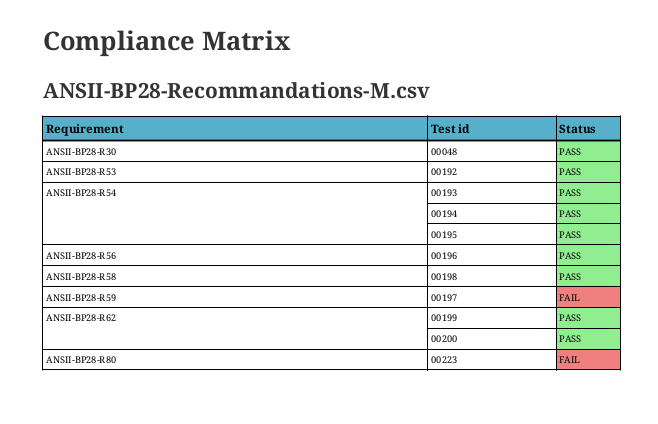

# Test report PDF

The goal of this tool is to generate asciidoc pdf which includes Junit .xml test
results.
This tool was mainly tested with cukinia generated Junit files.

## Usage

 $ ./compile.sh -h

A docker support is provided using [cqfd](https://github.com/savoirfairelinux/cqfd).
When building directly on the machine, asciidoctor-pdf and xmlstarlet are required.

## Features

Xml files are automatically detected and dispaled in the test report. Each file creates its own table with all tests one after another.
Several tables can be generated for the same file using cukinia suite feature : `logging suite "name"` in the cukinia configuration file. This will also change the title of the table.

To specify the table title for a machine, use the class feature of cukinia : `logging class "name"`. This will append "for name" in the title.

The source directory can be selected with the `-i` option. This directory shall contain all xml file to include to the test report.
It can also include a `prerequisites.adoc` file that will be added on top of the document and a `notes.adoc` file that will appear at the end. Both files are optional.


## Compliance matrix

This feature only works with the id feature provided by the `-s` option.

One or many compliance matrices can be added at the end of the report. These matrices are auto-generated by the program, using a csv file in entry.

The csv must contain on each line a requirement and a test id.
Here is an example :

```
cluster requirement,289
security requirement,143
security requirement,17
security requirement,23
stress resistance,34
stress resistance,35
documentation requirement,345
```
This csv file will be sorted alphabetically before being integrated in the document.

Please be aware that, for now, all csv files in the source directory are interpreted as compliance matrix.


